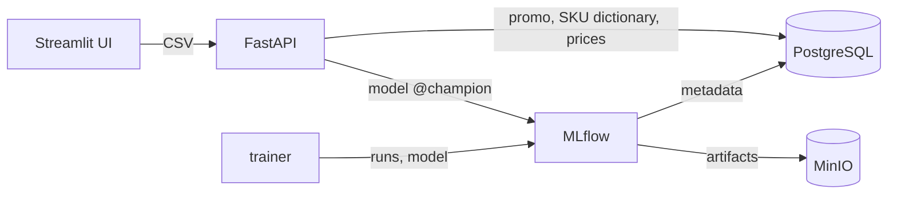

# Dynamic Pricing Service for E-Commerce

[](https://github.com/Lebedinskiy1377/deploy_ml_service/actions/workflows/ci.yml)

An end-to-end ML service that forecasts SKU demand and recommends a price that balances revenue (GMV) and margin.

## How it works

1. A LightGBM model forecasts demand for a SKU from the date, promo and product features.
2. The service generates candidate prices around the current price.
3. For every candidate it estimates demand, GMV and margin.
4. It returns the price with the best business score: GMV with a penalty for margin below the target.

## Architecture



| Component | Folder | Role |
| --- | --- | --- |
| trainer | `application/` | Trains the demand model and registers it in MLflow |
| api | `sku_price_model_service/` | FastAPI service: demand forecast and price optimization |
| frontend | `frontend_ml/` | Streamlit UI: CSV upload and charts |
| mlflow | `infra/mlflow/` | Tracking server and model registry (artifacts in MinIO, metadata in PostgreSQL) |
| seed | `scripts/seed_demo_db.py` | Loads demo tables into PostgreSQL |

**Stack:** Python, LightGBM, Optuna, scikit-learn, FastAPI, Streamlit, MLflow, PostgreSQL, MinIO, DVC, Docker Compose, GitHub Actions.

## Quick start

Requires Docker with Compose v2.

```bash
make demo
```

Then open the UI at <http://localhost:8501> and upload `examples/request.csv`.

| Service | URL |
| --- | --- |
| Streamlit UI | <http://localhost:8501> |
| FastAPI + Swagger | <http://localhost:8005/docs> |
| MLflow UI | <http://localhost:5001> |

Full training with hyperparameter search: `make train`. All commands: `make help`.
Default settings work out of the box; to override them, copy `.env.example` to `.env`.

## API

| Endpoint | Description |
| --- | --- |
| `GET /health` | Service status and loaded model version |
| `POST /invocation` | CSV in, demand forecast out |
| `POST /optimize_price` | CSV in, baseline scenario and recommended price for each row |

Required CSV columns: `dates`, `SKU`, `price_per_sku`. Other features are loaded from PostgreSQL.

```bash
curl -F "file=@examples/request.csv" http://localhost:8005/optimize_price
```

## ML details

**Demand model**
- Data: 6,699 observations for 25 SKUs (2018–2019).
- Validation: the last 10% of dates are a holdout; earlier data is used for time-series cross-validation and Optuna tuning (SMAPE). The holdout is never used for tuning or early stopping.
- A monotonic constraint on price guarantees that a higher price never increases predicted demand.
- The final model is retrained on all data and registered in MLflow with the `champion` alias; the API loads it on the first request.
- A training–serving parity test checks that the API builds exactly the same features the model was trained on.

**Price optimization**
- Candidates: 30 prices from 70% to 130% of the current price plus the current price itself, all scored in a single model call.
- The demand curve is made non-increasing with isotonic regression.
- Score for each candidate:

```text
GMV    = price * expected_demand
margin = (price - cost) / price
score  = GMV * (1 - lambda * max(0, target_margin - margin))
```

`target_margin` and `lambda` are configurable in `sku_price_model_service/app/config.py`.

## Limitations and next steps

- Prices in the demo data barely change within each SKU, so the model can learn only weak price elasticity. Real use needs data with price experiments to estimate elasticity reliably.
- Product costs in the demo data are synthetic.

## Development

```bash
make install   # dependencies for all components + pytest and ruff
make test
make lint
```

CI runs ruff, unit tests and an end-to-end `docker compose` run: start the stack, seed data, train the model and call the API.

Raw data is versioned with DVC; a processed sample (`application/data/processed/sku_sales.csv`) is committed so the project runs without access to the remote storage.
