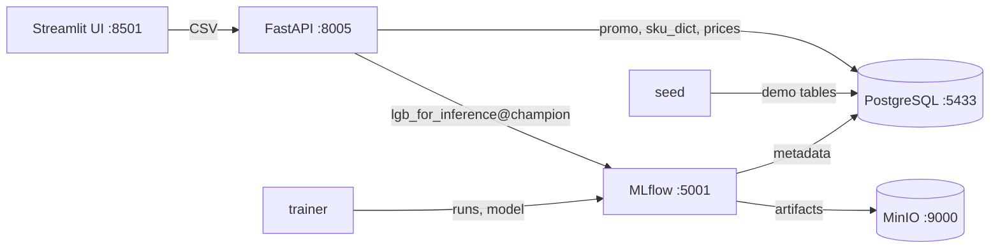

# Dynamic Pricing System for E-Commerce

[](https://github.com/Lebedinskiy1377/deploy_ml_service/actions/workflows/ci.yml)

ML-сервис для прогноза спроса и подбора цены SKU с учётом GMV и маржи.

## Бизнес-идея

Проект решает задачу динамического ценообразования для онлайн-ретейла:

1. По SKU, дате, промо и товарным признакам прогнозируется спрос.
2. Для текущей цены строится набор цен-кандидатов в допустимом диапазоне.
3. Для каждой цены оцениваются ожидаемый спрос, GMV и маржа.
4. Выбирается цена с максимальным бизнес-score: GMV со штрафом за маржу ниже целевой.

Так ищется цена, которая увеличивает оборот, но не игнорирует маржинальность.

## Архитектура



| Компонент | Папка | Что делает |
|---|---|---|
| trainer | `application/` | обучает LightGBM-модель спроса и регистрирует её в MLflow |
| api | `sku_price_model_service/` | FastAPI: прогноз спроса и оптимизация цены |
| frontend | `frontend_ml/` | Streamlit: загрузка CSV и графики |
| mlflow | `infra/mlflow/` | tracking server и model registry; артефакты в MinIO, метаданные в PostgreSQL |
| seed | `scripts/seed_demo_db.py` | заливает demo-таблицы `promo`, `sku_dict`, `prices` |

## Быстрый старт

Нужен Docker с Compose v2. `.env` не обязателен: у всех переменных есть значения по умолчанию, для своих значений скопируй `.env.example` в `.env`.

```bash
make demo
```

То же самое без make:

```bash
docker compose up -d --build        # PostgreSQL, MinIO, MLflow, API, UI
docker compose run --rm seed        # demo-таблицы в PostgreSQL
docker compose run --rm trainer --n-trials 1 --cv-splits 3 --max-estimators 300
docker compose restart api          # API подхватит новую модель
```

Дальше открой http://localhost:8501 и загрузи `examples/request.csv`.

Полное обучение с подбором гиперпараметров (20 trials Optuna, около минуты): `make train`.

| Сервис | Адрес |
|---|---|
| Streamlit UI | http://localhost:8501 |
| FastAPI + Swagger | http://localhost:8005/docs |
| MLflow UI | http://localhost:5001 |
| MinIO console | http://localhost:9001 (`minioadmin` / `minioadmin`) |
| PostgreSQL | `localhost:5433`, база `pricing`, пользователь `pricing` / `pricing` |

`make help` покажет остальные команды, `make clean` остановит стек и удалит его данные.

## API

- `GET /health` — статус и версия загруженной модели.
- `POST /invocation` — CSV → те же строки с прогнозом спроса в колонке `num_purchases`.
- `POST /optimize_price` — CSV → базовый сценарий и оптимальная цена по каждой строке.

Обязательные колонки CSV: `dates`, `SKU`, `price_per_sku`. Необязательная `discount` используется, если на эту неделю нет промо в таблице `promo`. Остальные признаки API берёт из PostgreSQL.

```bash
curl -F "file=@examples/request.csv" http://localhost:8005/optimize_price
```

Ответ `/optimize_price`:

| Поле | Значение |
|---|---|
| `dates`, `SKU` | из запроса |
| `price_per_sku`, `cost` | цена из запроса и себестоимость из таблицы `prices` |
| `base_demand`, `base_gmv`, `base_margin` | базовый сценарий при цене из запроса |
| `optimal_price`, `expected_demand`, `gmv`, `margin`, `score` | лучший из кандидатов |

Ошибки: `400` — плохой CSV, неизвестный SKU, неположительная цена; `503` — таблицы не загружены (`seed`) или модель ещё не обучена (`trainer`).

## ML-логика

Модель спроса обучается на `application/data/processed/sku_sales.csv`: 6699 наблюдений, 25 SKU, 2018-01-17 — 2019-12-24.

- Последние 10% дат — holdout, более ранние — time-series CV и подбор гиперпараметров Optuna по SMAPE.
- `margin` не попадает в признаки. У цены монотонное ограничение `-1`: при прочих равных рост цены не повышает прогноз спроса.
- После оценки на holdout модель переобучается на всём датасете, регистрируется в MLflow как `lgb_for_inference` и получает alias `champion`.
- API загружает `champion` при первом запросе и держит в памяти; после переобучения API нужно перезапустить (`make train` делает это сам).
- Тест `test_training_parity.py` проверяет, что API строит для каждой строки датасета ровно те признаки, на которых училась модель.

Оптимизация: 30 цен-кандидатов в диапазоне 70%..130% от цены из запроса, все кандидаты считаются одним вызовом модели. Кривая спроса дополнительно делается невозрастающей изотонической регрессией. Для каждого кандидата:

```text
GMV    = price * expected_demand
margin = (price - cost) / price
score  = GMV * (1 - lambda * max(0, target_margin - margin))
```

По умолчанию `target_margin = 0.5`, `lambda = 0.5` (`sku_price_model_service/app/config.py`).

### Ограничения

- На demo-данных цена каждого SKU почти не менялась, поэтому модель слабо реагирует на цену: +30% к цене снижает прогноз спроса лишь на пару процентов. Из-за этого оптимизатор почти для всех SKU выбирает верхнюю границу диапазона. Это свойство данных и модели, а не оптимизатора; перед реальным использованием нужна проверка эластичности на данных с ценовыми экспериментами.
- Себестоимость синтетическая: колонку `margin` сгенерировал ноутбук `sku.ipynb` (5–30% от цены, выше при низком спросе), а `seed` выводит из неё `cost`. Целевая маржа 0.5 выше любой маржи в данных, поэтому штраф действует всегда.

## Структура репозитория

```text
application/              обучение модели спроса
  data/processed/         sku_sales.csv (в git) и DVC-указатели
  data/raw/               DVC-указатели на сырые выгрузки
  notebooks/              исследовательские ноутбуки
  src/models/             train_model.py, metrics.py
  tests/                  тесты пайплайна обучения
sku_price_model_service/  FastAPI-сервис (app/) и его тесты (tests/)
frontend_ml/              Streamlit UI
infra/                    образ MLflow и init-скрипт PostgreSQL
scripts/seed_demo_db.py   заливка demo-таблиц
examples/request.csv      пример запроса к API и UI
```

## Разработка

```bash
python3.11 -m venv .venv && source .venv/bin/activate
make install   # зависимости всех компонентов + pytest и ruff
make test
make lint      # make format исправит стиль
```

Запуск компонентов на хосте против стека из Docker (значения по умолчанию совпадают с портами compose):

```bash
cd sku_price_model_service && uvicorn app.main:app --port 8005
cd application && python -m src.models.train_model --n-trials 1
```

CI (GitHub Actions) гоняет ruff, тесты и end-to-end прогон `docker compose`: подъём стека, seed, обучение и запрос к API.

## Данные и DVC

`sku_sales.csv` лежит в git, чтобы проект запускался без доступа к хранилищу. Сырые выгрузки (`application/data/raw/*.dvc`) лежат в DVC remote в S3 Timeweb Cloud. Ключи доступа не хранятся в репозитории, их нужно положить в `application/.dvc/config.local` (он в `.gitignore`):

```bash
cd application
dvc remote modify --local remote access_key_id <key>
dvc remote modify --local remote secret_access_key <secret>
dvc pull
```

Пакеты для ноутбуков и DVC: `pip install -r application/requirements-notebooks.txt`.

## Переход со старой версии

Раньше состояние MinIO хранилось в папке `./minio` в репозитории, а сервисы имели фиксированные `container_name`. Теперь данные живут в Docker volumes проекта `dynamic-pricing`, поэтому после обновления:

1. Останови старый стек (`docker compose down` в старой версии), иначе порты будут заняты.
2. Подними новый и заново выполни `seed` и `trainer` (или `make demo`).
